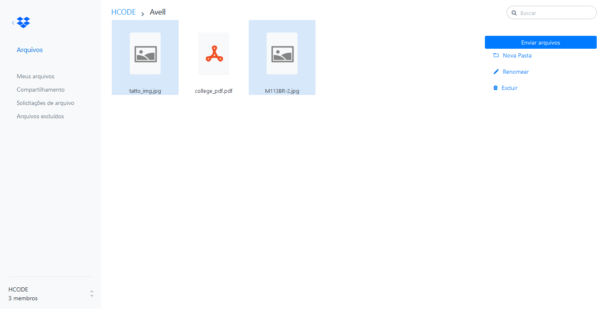

<!-- Title --> 
# Dropbox Clone

<p align="center">
  <a href="" rel="noopener">
 </a>
</p>

<!-- Who made it --> 
##### Tutorial by Hcode Treinamentos
<!-- About the project --> 
## About <a name = "about"></a>

In this project we make a Dropbox Clone and you can create folder, subfolders, upload images/videos/pdfs using Firebase to Storage for save files.  

### How to execute

```
git clone https://github.com/joaogalvesluiz/dropbox-clone.git
- first install 
cd app/public 

bower install
```

```
- second install
cd ../ to back app folder then install 

npm install - for install all dependencies
npm start - live project client-server port 3000
```

<!-- Features Used in --> 
## 📖 Features Used <a name = "about"></a>
  * Express Generator
  * [Formidable Form](https://www.npmjs.com/package/formidable)
    * A Node.js module for parsing form data, especially file uploads.]
  * Firebase Realtime Application
    * Create Folders, Upload, Remove, Rename files
  * Firebase Storage  
  * Bower Components for Visual Css


### 📧 Contact 
E-mail: joaog.alvesluiz@gmail.com
